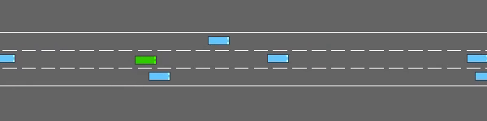
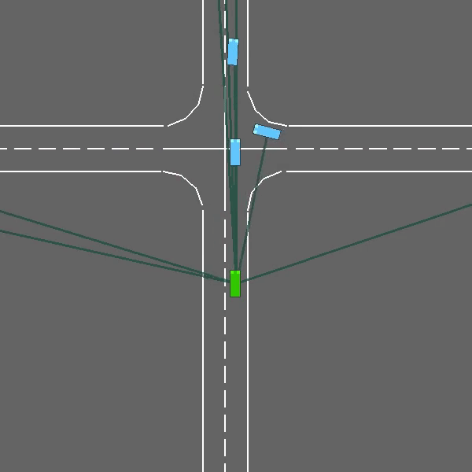

# behavioural_planning_autonomous_driving
Behavioral planning with Reinforcement Learning algorithms using Gynmasium (Previously OpenAI gym)

Report (in progress)


Click [here](https://docs.google.com/document/d/1RdgXRRZ7Fi1EvPcNhPmgXT8O06KzQyNHx_sZiGMJk3s/edit?usp=sharing) for Report

## Dependencies
```
pip install highway-env
pip install git+https://github.com/eleurent/rl-agents
pip install moviepy -U
pip install imageio_ffmpeg
pip install pyvirtualdisplay
pip install tensorflow
sudo apt-get install -y xvfb python-opengl ffmpeg
pip install ipywidgets

```

## Steps to run the code
```
git clone https://github.com/sharmithag/behavioural_planning_autonomous_driving.git
git clone https://github.com/eleurent/highway-env.git
git clone https://github.com/eleurent/rl-agents.git

python3 highway_fast_dp.py

python3 highway_fast_mcts.py

python3 intersection_dqn.py

python3 roundabout_dp.py

python3 roundabout_MCTS.py
```
Then there will be a folder created named out and the video will be saved according to the environment respectively.

## Results

### Highway Lane change


### Intersection
